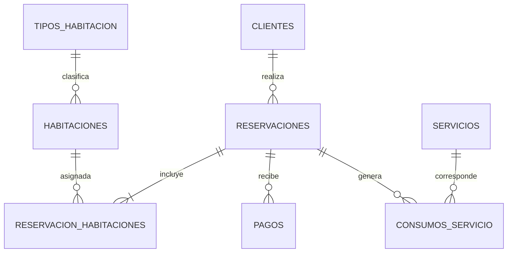

# Guía de desarrollo — Sistema de Gestión Hotelera con PostgreSQL

> **Documento de trabajo del proyecto.**  
> Este archivo sirve como guía para construir, verificar y desplegar la base de datos.  
> **No forma parte del reporte final de la materia.**

---

## 1. Nombre del proyecto

**Sistema de Gestión Hotelera y Reservaciones**

---

## 2. Contexto del proyecto

El proyecto consiste en diseñar e implementar una base de datos relacional para administrar las operaciones principales de un hotel.

La base de datos deberá permitir gestionar:

- clientes;
- tipos de habitación;
- habitaciones;
- reservaciones;
- habitaciones asignadas a cada reservación;
- pagos;
- servicios adicionales;
- consumos de servicios.

El objetivo principal del proyecto **no es desarrollar una interfaz web**, sino demostrar que la base de datos:

- está correctamente diseñada;
- conserva la integridad de los datos;
- soporta operaciones CRUD;
- permite realizar consultas entre varias tablas;
- responde correctamente ante datos inválidos;
- puede trabajar con un volumen mayor de información;
- utiliza índices de manera justificada;
- puede manejar operaciones concurrentes;
- puede ser desplegada en un entorno remoto.

---

# 3. Tecnología principal

## PostgreSQL

Se utilizará **PostgreSQL** como sistema gestor de base de datos.

### Versión recomendada

Usar la misma versión mayor en local y en AWS.

Recomendación:

```text
PostgreSQL 17.x
```

No es necesario que la versión menor sea exactamente igual, pero es conveniente que ambas instalaciones pertenezcan a la misma versión mayor.

---

# 4. Herramientas del proyecto

## Herramientas obligatorias/recomendadas

| Herramienta | Uso |
|---|---|
| PostgreSQL | Motor de base de datos |
| DBeaver Community | Administrar y consultar PostgreSQL |
| Visual Studio Code | Editar scripts SQL y documentación |
| Git | Control de versiones |
| GitHub | Repositorio del proyecto |
| Amazon RDS | Despliegue remoto de PostgreSQL |
| GitHub Markdown | Documentación de desarrollo |

## Herramientas que NO son necesarias

Por el momento no utilizar:

- Docker;
- React;
- Next.js;
- Java;
- Spring Boot;
- Node.js;
- APIs;
- frontend.

Estas herramientas solo deberían agregarse si posteriormente el profesor solicita una aplicación que utilice la base de datos.

---

# 5. Arquitectura del proyecto

Durante el desarrollo:

```text
┌──────────────────────────────┐
│        Computadora local     │
│                              │
│  VS Code                     │
│  DBeaver                     │
│  PostgreSQL 17               │
└──────────────┬───────────────┘
               │
               │ Git
               ▼
        ┌──────────────┐
        │    GitHub    │
        └──────────────┘
```

Cuando el proyecto esté funcionando:

```text
┌─────────────────────┐
│       DBeaver       │
└─────────┬───────────┘
          │
          │ conexión PostgreSQL
          ▼
┌─────────────────────────────┐
│         Amazon AWS          │
│                             │
│  Amazon RDS for PostgreSQL  │
│                             │
│  hotel_db                   │
└─────────────────────────────┘
```

La base de datos local se utilizará para desarrollar y probar.

Amazon RDS se utilizará posteriormente para comprobar que el proyecto también funciona en un servidor PostgreSQL remoto.

---

# 6. Estructura del repositorio

Crear un repositorio con una estructura similar a:

```text
hotel-database/
│
├── README.md
│
├── docs/
│   ├── desarrollo.md
│   └── modelo-datos.md
│
├── sql/
│   ├── 01_schema.sql
│   ├── 02_constraints.sql
│   ├── 03_seed.sql
│   ├── 04_crud.sql
│   ├── 05_queries.sql
│   ├── 06_indexes.sql
│   ├── 07_tests.sql
│   ├── 08_volume_tests.sql
│   └── 09_cleanup.sql
│
└── evidence/
    ├── local/
    └── aws/
```

### Importante

Los archivos de `evidence/` podrán contener capturas durante el desarrollo, pero el reporte final deberá prepararse por separado.

---

# 7. Modelo inicial de la base de datos

Se propone trabajar con las siguientes tablas:

```text
clientes
tipos_habitacion
habitaciones
reservaciones
reservacion_habitaciones
pagos
servicios
consumos_servicio
```

---

# 8. Relaciones principales



---

# 9. Diseño preliminar de tablas

## 9.1 clientes

Representa a las personas que realizan reservaciones.

Campos sugeridos:

| Campo | Tipo aproximado | Regla |
|---|---|---|
| id_cliente | BIGINT | PK |
| nombre | VARCHAR(80) | NOT NULL |
| apellido | VARCHAR(100) | NOT NULL |
| correo | VARCHAR(150) | NOT NULL, UNIQUE |
| telefono | VARCHAR(20) | opcional |
| fecha_registro | TIMESTAMP | NOT NULL |

---

## 9.2 tipos_habitacion

Define categorías como sencilla, doble, suite, etc.

| Campo | Tipo | Regla |
|---|---|---|
| id_tipo | SMALLINT/BIGINT | PK |
| nombre | VARCHAR(50) | NOT NULL, UNIQUE |
| descripcion | VARCHAR/TEXT | opcional |
| capacidad | SMALLINT | mayor que 0 |
| precio_noche | NUMERIC(10,2) | mayor que 0 |

---

## 9.3 habitaciones

Representa cada habitación física.

| Campo | Tipo | Regla |
|---|---|---|
| id_habitacion | BIGINT | PK |
| numero | VARCHAR(10) | UNIQUE, NOT NULL |
| id_tipo | FK | NOT NULL |
| piso | SMALLINT | NOT NULL |
| activa | BOOLEAN | NOT NULL |

Una habitación inactiva representa una habitación temporalmente fuera de servicio.

---

## 9.4 reservaciones

Almacena la reservación general realizada por el cliente.

| Campo | Tipo | Regla |
|---|---|---|
| id_reservacion | BIGINT | PK |
| id_cliente | BIGINT | FK, NOT NULL |
| fecha_reserva | TIMESTAMP | NOT NULL |
| fecha_entrada | DATE | NOT NULL |
| fecha_salida | DATE | NOT NULL |
| estado | VARCHAR | NOT NULL |
| total_estimado | NUMERIC(12,2) | >= 0 |

Regla importante:

```text
fecha_salida > fecha_entrada
```

Estados posibles:

```text
PENDIENTE
CONFIRMADA
EN_CURSO
FINALIZADA
CANCELADA
```

---

## 9.5 reservacion_habitaciones

Tabla intermedia entre reservaciones y habitaciones.

| Campo | Tipo | Regla |
|---|---|---|
| id_reservacion_habitacion | BIGINT | PK |
| id_reservacion | BIGINT | FK |
| id_habitacion | BIGINT | FK |
| precio_noche | NUMERIC(10,2) | > 0 |

Permite que una reservación tenga una o más habitaciones.

---

## 9.6 pagos

Registra pagos de una reservación.

| Campo | Tipo | Regla |
|---|---|---|
| id_pago | BIGINT | PK |
| id_reservacion | BIGINT | FK |
| fecha_pago | TIMESTAMP | NOT NULL |
| monto | NUMERIC(12,2) | > 0 |
| metodo | VARCHAR(30) | NOT NULL |
| referencia | VARCHAR(100) | opcional |

Métodos posibles:

```text
EFECTIVO
TARJETA
TRANSFERENCIA
```

---

## 9.7 servicios

Catálogo de servicios adicionales.

Ejemplos:

```text
Desayuno
Lavandería
Room service
Estacionamiento
```

Campos:

| Campo | Tipo | Regla |
|---|---|---|
| id_servicio | BIGINT | PK |
| nombre | VARCHAR(80) | UNIQUE |
| precio | NUMERIC(10,2) | >= 0 |
| activo | BOOLEAN | NOT NULL |

---

## 9.8 consumos_servicio

Registra servicios consumidos durante una reservación.

| Campo | Tipo | Regla |
|---|---|---|
| id_consumo | BIGINT | PK |
| id_reservacion | BIGINT | FK |
| id_servicio | BIGINT | FK |
| cantidad | INTEGER | > 0 |
| precio_unitario | NUMERIC(10,2) | >= 0 |
| fecha_consumo | TIMESTAMP | NOT NULL |

---

# 10. Reglas de negocio iniciales

Estas reglas deberán implementarse o validarse durante el proyecto.

1. Un correo de cliente no puede repetirse.
2. Una reservación debe pertenecer a un cliente existente.
3. Una habitación debe pertenecer a un tipo de habitación existente.
4. La fecha de salida debe ser posterior a la fecha de entrada.
5. Un pago debe ser mayor que cero.
6. Un consumo debe tener una cantidad mayor que cero.
7. Los precios no pueden ser negativos.
8. No se debe eliminar un cliente que tenga información histórica sin analizar las consecuencias.
9. Una reservación cancelada no debe considerarse ocupación activa.
10. Una habitación inactiva no debe asignarse a nuevas reservaciones.
11. Una misma habitación no debe tener dos reservaciones activas que se traslapen en fechas.
12. Las operaciones que afecten varios registros deben analizarse para determinar si necesitan una transacción.

---

# 11. Orden obligatorio de desarrollo

No construir todo de una sola vez.

Trabajar por etapas.

Cada etapa incluye un **punto de verificación**.

Si una verificación falla, corregir el problema antes de continuar.

---

# ETAPA 0 — Preparar el entorno

## Instalar

- PostgreSQL 17.x
- DBeaver Community
- Git
- VS Code

## Verificar PostgreSQL

En terminal:

```bash
psql --version
```

Debe aparecer una versión similar a:

```text
psql (PostgreSQL) 17.x
```

Después entrar a PostgreSQL y ejecutar:

```sql
SELECT version();
```

## Punto de control 0

No continuar hasta comprobar:

- [ ] PostgreSQL está instalado.
- [ ] `psql --version` funciona.
- [ ] DBeaver abre correctamente.
- [ ] DBeaver puede conectarse al PostgreSQL local.
- [ ] `SELECT version();` devuelve información de PostgreSQL.

---

# ETAPA 1 — Crear el repositorio

Crear la carpeta:

```bash
mkdir hotel-database
cd hotel-database
git init
```

Crear la estructura de directorios.

Después:

```bash
git add .
git commit -m "chore: initialize hotel database project"
```

## Punto de control 1

Ejecutar:

```bash
git status
```

Debe mostrar:

```text
nothing to commit, working tree clean
```

Comprobar:

- [ ] existe la carpeta `sql`;
- [ ] existe la carpeta `docs`;
- [ ] existe `README.md`;
- [ ] Git está inicializado;
- [ ] existe el primer commit.

---

# ETAPA 2 — Crear la base de datos local

Nombre:

```text
hotel_db
```

Desde PostgreSQL:

```sql
CREATE DATABASE hotel_db;
```

Conectarse posteriormente a:

```text
hotel_db
```

## Verificación

Ejecutar:

```sql
SELECT current_database();
```

Resultado esperado:

```text
hotel_db
```

## Punto de control 2

- [ ] `hotel_db` existe.
- [ ] DBeaver puede conectarse.
- [ ] `SELECT current_database();` devuelve `hotel_db`.
- [ ] todavía no existen las tablas del proyecto.

---

# ETAPA 3 — Crear el esquema

Trabajar en:

```text
sql/01_schema.sql
```

Crear primero todas las tablas.

Orden recomendado:

```text
1. clientes
2. tipos_habitacion
3. habitaciones
4. reservaciones
5. reservacion_habitaciones
6. pagos
7. servicios
8. consumos_servicio
```

Esto reduce problemas con llaves foráneas.

## Verificación

Después de ejecutar el script:

```sql
SELECT table_name
FROM information_schema.tables
WHERE table_schema = 'public'
ORDER BY table_name;
```

Deben aparecer las ocho tablas.

También ejecutar:

```sql
SELECT COUNT(*)
FROM information_schema.tables
WHERE table_schema = 'public';
```

Verificar que el número corresponda con las tablas creadas por el proyecto.

## Punto de control 3

- [ ] las 8 tablas fueron creadas;
- [ ] cada tabla posee PK;
- [ ] las FK apuntan a las tablas correctas;
- [ ] no hubo errores al ejecutar `01_schema.sql`;
- [ ] el script puede ejecutarse desde una base limpia.

---

# ETAPA 4 — Implementar restricciones

Archivo:

```text
sql/02_constraints.sql
```

Revisar e implementar:

- `PRIMARY KEY`;
- `FOREIGN KEY`;
- `NOT NULL`;
- `UNIQUE`;
- `CHECK`;
- acciones apropiadas para `ON DELETE` cuando sea necesario.

Ejemplos de reglas:

```sql
CHECK (fecha_salida > fecha_entrada)
```

```sql
CHECK (monto > 0)
```

```sql
CHECK (cantidad > 0)
```

```sql
CHECK (precio >= 0)
```

## Verificación de restricciones

No basta con observar la definición.

Hay que intentar romperlas.

### Prueba A

Intentar registrar un precio negativo.

Esperado:

```text
ERROR
```

### Prueba B

Intentar registrar dos clientes con el mismo correo.

Esperado:

```text
ERROR por UNIQUE
```

### Prueba C

Crear una reservación con un cliente que no existe.

Esperado:

```text
ERROR por FOREIGN KEY
```

### Prueba D

Crear:

```text
entrada = 2026-10-20
salida = 2026-10-18
```

Esperado:

```text
ERROR por CHECK
```

## Punto de control 4

No avanzar hasta comprobar que:

- [ ] los datos válidos se aceptan;
- [ ] los duplicados requeridos se rechazan;
- [ ] las FK inválidas se rechazan;
- [ ] las fechas inválidas se rechazan;
- [ ] los valores negativos se rechazan.

---

# ETAPA 5 — Cargar datos de prueba

Archivo:

```text
sql/03_seed.sql
```

Cantidad inicial sugerida:

```text
20 clientes
4 tipos de habitación
20 habitaciones
25 reservaciones
30 asignaciones de habitación
20 pagos
6 servicios
20 consumos
```

No comenzar todavía con decenas de miles de registros.

Primero comprobar el modelo con un conjunto pequeño y comprensible.

## Verificación

Ejecutar:

```sql
SELECT COUNT(*) FROM clientes;
SELECT COUNT(*) FROM habitaciones;
SELECT COUNT(*) FROM reservaciones;
SELECT COUNT(*) FROM pagos;
```

Realizar también algunas consultas manuales:

```sql
SELECT * FROM clientes LIMIT 10;
```

```sql
SELECT * FROM habitaciones ORDER BY numero;
```

## Punto de control 5

- [ ] existen datos en todas las tablas principales;
- [ ] ninguna FK quedó apuntando a registros inexistentes;
- [ ] los datos son coherentes;
- [ ] las reservaciones poseen fechas válidas;
- [ ] los precios y cantidades son válidos.

---

# ETAPA 6 — CRUD

Archivo:

```text
sql/04_crud.sql
```

Preparar ejemplos para:

## CREATE

Registrar:

- cliente;
- habitación;
- reservación;
- pago;
- consumo.

## READ

Consultar:

- clientes;
- habitaciones;
- reservaciones;
- pagos.

## UPDATE

Modificar:

- teléfono de cliente;
- estado de reservación;
- precio de un servicio.

## DELETE

Probar cuidadosamente:

- eliminar un registro sin relaciones;
- intentar eliminar un registro que tenga relaciones.

No utilizar `CASCADE` automáticamente solo para evitar errores.

Primero analizar qué comportamiento tiene sentido para la información histórica.

## Punto de control 6

Comprobar que:

- [ ] INSERT funciona;
- [ ] SELECT funciona;
- [ ] UPDATE modifica únicamente los registros esperados;
- [ ] DELETE respeta las relaciones;
- [ ] ninguna operación deja datos huérfanos.

Antes y después de un `UPDATE` o `DELETE`, ejecutar un `SELECT` para comprobar exactamente qué cambió.

---

# ETAPA 7 — Consultas importantes

Archivo:

```text
sql/05_queries.sql
```

Crear consultas para responder preguntas reales.

## Q01 — Reservaciones de un cliente

Mostrar:

```text
cliente
reservación
entrada
salida
estado
```

---

## Q02 — Habitaciones incluidas en una reservación

Debe utilizar al menos:

```text
reservaciones
reservacion_habitaciones
habitaciones
tipos_habitacion
```

---

## Q03 — Total pagado por reservación

Utilizar:

```sql
SUM()
GROUP BY
```

---

## Q04 — Saldo pendiente

Conceptualmente:

```text
total_estimado - total_pagado
```

---

## Q05 — Ingresos por mes

Utilizar:

```text
pagos
fecha_pago
SUM()
GROUP BY
```

---

## Q06 — Habitaciones más utilizadas

Utilizar:

```text
COUNT
GROUP BY
ORDER BY
```

---

## Q07 — Clientes con más reservaciones

Utilizar:

```text
JOIN
COUNT
GROUP BY
ORDER BY
```

---

## Q08 — Servicios más consumidos

Cruzar:

```text
consumos_servicio
servicios
```

---

## Q09 — Reservaciones activas

Considerar:

```text
CONFIRMADA
EN_CURSO
```

---

## Q10 — Disponibilidad entre dos fechas

Esta será una de las consultas importantes del proyecto.

La consulta debe determinar qué habitaciones no poseen una reservación activa que se traslape con el periodo solicitado.

Ejemplo:

```text
Fecha solicitada:
2026-11-10 al 2026-11-14
```

El resultado debe mostrar únicamente las habitaciones disponibles.

## Punto de control 7

Para cada consulta:

- [ ] ejecutar la consulta;
- [ ] revisar manualmente algunos resultados;
- [ ] comprobar que los JOIN no dupliquen información incorrectamente;
- [ ] comprobar que los cálculos coincidan con los datos originales.

---

# ETAPA 8 — Resolver traslapes de reservaciones

Este punto es esencial para el proyecto.

Situación:

```text
Habitación 101
Reserva A: 10 al 15 de noviembre
Reserva B: 12 al 14 de noviembre
```

La segunda reservación entra en conflicto.

Se deberá estudiar cómo garantizar que el sistema detecte el traslape.

Inicialmente se puede detectar mediante una consulta.

Posteriormente se analizará si debe implementarse mediante:

- transacción;
- restricción avanzada de PostgreSQL;
- función/trigger;
- lógica adicional.

No elegir una solución sin probarla.

## Casos obligatorios

```text
A: 10–15
B: 12–14       -> conflicto

A: 10–15
B: 08–11       -> conflicto

A: 10–15
B: 14–18       -> conflicto

A: 10–15
B: 15–20       -> definir claramente la regla

A: 10–15
B: 16–20       -> disponible
```

## Punto de control 8

- [ ] cada caso fue probado;
- [ ] se conoce exactamente qué intervalos se consideran conflicto;
- [ ] el resultado es consistente;
- [ ] la regla está definida antes de continuar.

---

# ETAPA 9 — Índices

Archivo:

```text
sql/06_indexes.sql
```

No crear índices aleatoriamente.

Primero identificar consultas frecuentes.

Posibles columnas:

```text
reservaciones.id_cliente
reservaciones.fecha_entrada
reservaciones.fecha_salida
pagos.id_reservacion
pagos.fecha_pago
reservacion_habitaciones.id_habitacion
```

Las PK y algunas restricciones `UNIQUE` ya generan índices automáticamente en PostgreSQL, por lo que deberán revisarse antes de crear índices duplicados.

## Antes de crear un índice

Usar:

```sql
EXPLAIN ANALYZE
SELECT ...
```

Guardar el resultado.

Después crear el índice.

Volver a ejecutar:

```sql
EXPLAIN ANALYZE
SELECT ...
```

Comparar:

```text
plan de ejecución
tiempo
filas procesadas
tipo de búsqueda
```

## Punto de control 9

- [ ] cada índice posee una razón;
- [ ] no se están duplicando índices existentes;
- [ ] se utilizó `EXPLAIN ANALYZE`;
- [ ] se comparó al menos una consulta antes y después del índice.

---

# ETAPA 10 — Pruebas formales

Archivo:

```text
sql/07_tests.sql
```

Crear pruebas para:

### Datos correctos

```text
registro válido
consulta válida
actualización válida
```

### Restricciones

```text
correo duplicado
FK inexistente
precio negativo
pago igual a cero
cantidad negativa
fecha de salida inválida
```

### Relaciones

```text
cliente + reservaciones
reservación + habitaciones
reservación + pagos
reservación + servicios
```

### Eliminaciones

Comprobar qué sucede al intentar eliminar información relacionada.

## Regla

Una prueba que produzca un `ERROR` puede ser una prueba exitosa.

Ejemplo:

```text
Se intenta insertar un pago de -500.

Resultado esperado:
PostgreSQL rechaza el registro.

Resultado obtenido:
PostgreSQL devuelve error de CHECK.

Conclusión:
La restricción funciona.
```

---

# ETAPA 11 — Volumen de datos

Archivo:

```text
sql/08_volume_tests.sql
```

Solo realizar esta etapa después de que el modelo pequeño funcione correctamente.

Escalas sugeridas:

```text
1,000 reservaciones
10,000 reservaciones
50,000 reservaciones
```

No es necesario comenzar directamente con 1 millón.

PostgreSQL permite generar datos con herramientas como:

```sql
generate_series()
```

Registrar tiempos de consultas importantes.

Repetir:

```sql
EXPLAIN ANALYZE
```

con diferentes cantidades de datos.

## Punto de control 11

Comparar:

```text
consulta con pocos registros
consulta con 1,000
consulta con 10,000
consulta con 50,000
```

Identificar:

- [ ] cuáles consultas crecen de forma aceptable;
- [ ] cuáles se vuelven lentas;
- [ ] si PostgreSQL utiliza los índices;
- [ ] qué consultas podrían necesitar mejoras.

---

# ETAPA 12 — Transacciones

Probar operaciones que necesiten realizarse completamente o no realizarse.

Ejemplo conceptual:

```text
Crear reservación
+
Asignar habitación
+
Registrar información relacionada
```

Si una parte falla, puede ser necesario revertir todo.

Trabajar con:

```sql
BEGIN;
```

```sql
COMMIT;
```

```sql
ROLLBACK;
```

## Prueba

1. iniciar una transacción;
2. insertar una reservación;
3. provocar intencionalmente un error en una operación posterior;
4. ejecutar `ROLLBACK`;
5. comprobar si quedó información parcial.

## Punto de control 12

Después del rollback:

```sql
SELECT ...
```

Debe confirmar que los cambios que debían revertirse realmente desaparecieron.

---

# ETAPA 13 — Concurrencia

Esta prueba requiere dos sesiones de DBeaver.

Abrir:

```text
Consola A
Consola B
```

Simular que dos usuarios intentan operar sobre la misma información.

Caso principal:

```text
Usuario A intenta reservar habitación 101.

Usuario B intenta reservar habitación 101
para fechas incompatibles prácticamente al mismo tiempo.
```

Analizar:

- transacciones;
- aislamiento;
- bloqueos;
- conflictos;
- posibilidad de doble reservación.

No asumir que porque una consulta funciona con un usuario también funcionará con dos usuarios simultáneos.

## Punto de control 13

Responder técnicamente:

```text
¿pueden terminar existiendo dos reservaciones incompatibles?
```

Si la respuesta es sí, el diseño todavía necesita mejorar antes de considerarse validado.

---

# ETAPA 14 — Limpieza y recreación completa

Archivo:

```text
sql/09_cleanup.sql
```

Antes del despliegue, comprobar que el proyecto puede reconstruirse desde cero.

Proceso:

```text
base vacía
   ↓
01_schema.sql
   ↓
02_constraints.sql
   ↓
03_seed.sql
   ↓
06_indexes.sql
```

Después ejecutar las consultas y pruebas.

## Punto de control 14

El proyecto debe poder recrearse sin depender de modificaciones manuales hechas solamente desde DBeaver.

Esta condición es muy importante.

---

# ETAPA 15 — Despliegue en Amazon RDS

No desplegar en AWS hasta que la base local funcione.

Servicio:

```text
Amazon RDS for PostgreSQL
```

Utilizar una versión mayor compatible con la versión local.

Ejemplo:

```text
PostgreSQL 17.x
```

## Seguridad

Para un proyecto académico al que se accederá desde la computadora personal:

- no colocar la contraseña en GitHub;
- utilizar una contraseña fuerte;
- restringir el Security Group;
- si se habilita acceso público para conectarse desde casa, permitir PostgreSQL únicamente desde una IP confiable;
- evitar una regla `0.0.0.0/0` para el puerto 5432;
- eliminar recursos que ya no sean necesarios y revisar el consumo/costos de AWS.

### Nunca subir a GitHub

```text
endpoint
usuario
contraseña
credenciales AWS
archivos .env con secretos
```

Agregar al `.gitignore` cualquier archivo que contenga credenciales.

---

# ETAPA 16 — Conectar DBeaver a RDS

Los datos que proporcionará AWS serán similares a:

```text
Host: endpoint-de-rds
Port: 5432
Database: hotel_db
Username: usuario
Password: ********
```

Probar:

```sql
SELECT version();
```

Después:

```sql
SELECT current_database();
```

## Punto de control 16

- [ ] DBeaver conecta con RDS;
- [ ] PostgreSQL responde;
- [ ] se está usando la base correcta;
- [ ] la conexión está restringida correctamente.

---

# ETAPA 17 — Desplegar el esquema en RDS

Ejecutar los mismos scripts utilizados localmente.

Orden:

```text
01_schema.sql
02_constraints.sql
03_seed.sql
06_indexes.sql
```

No crear una versión diferente del esquema para AWS.

La misma definición debe funcionar en local y remoto.

## Verificación

Ejecutar:

```sql
SELECT table_name
FROM information_schema.tables
WHERE table_schema = 'public'
ORDER BY table_name;
```

Comparar con local.

Después:

```sql
SELECT COUNT(*) FROM clientes;
SELECT COUNT(*) FROM habitaciones;
SELECT COUNT(*) FROM reservaciones;
```

## Punto de control 17

- [ ] existen las mismas tablas;
- [ ] existen las mismas restricciones;
- [ ] existen los índices esperados;
- [ ] las consultas importantes funcionan;
- [ ] los datos de prueba están disponibles.

---

# ETAPA 18 — Validación final remota

Volver a ejecutar en AWS los casos importantes:

```text
INSERT válido
INSERT inválido
FK inválida
CHECK inválido
UNIQUE duplicado
SELECT con JOIN
UPDATE
DELETE
consulta de disponibilidad
transacción
```

Comparar el comportamiento entre:

```text
PostgreSQL local
vs.
Amazon RDS PostgreSQL
```

Los resultados lógicos deberían ser equivalentes.

---

# 12. Consultas que el proyecto debe poder resolver

Al terminar, la base debe responder como mínimo:

1. ¿Qué reservaciones tiene determinado cliente?
2. ¿Qué habitaciones pertenecen a cada reservación?
3. ¿Qué tipo tiene cada habitación?
4. ¿Cuánto ha pagado una reservación?
5. ¿Cuánto falta por pagar?
6. ¿Qué habitaciones están disponibles entre dos fechas?
7. ¿Cuáles habitaciones han sido más utilizadas?
8. ¿Cuántas reservaciones fueron realizadas por mes?
9. ¿Cuánto dinero ingresó el hotel en un periodo?
10. ¿Cuáles servicios se consumieron más?
11. ¿Qué reservaciones están actualmente activas?
12. ¿Qué clientes han realizado más reservaciones?
13. ¿Qué reservaciones fueron canceladas?
14. ¿Qué habitaciones están inactivas?
15. ¿Existe algún conflicto entre reservaciones?

---

# 13. Criterios para considerar una etapa terminada

Cada funcionalidad debe verificarse de esta forma:

```text
1. Ejecutar.
2. Observar resultado.
3. Comparar con el resultado esperado.
4. Consultar nuevamente los datos.
5. Corregir si existe diferencia.
6. Solo entonces continuar.
```

Ejemplo:

```sql
UPDATE clientes
SET telefono = '9611234567'
WHERE id_cliente = 1;
```

No considerar terminado únicamente porque PostgreSQL mostró:

```text
UPDATE 1
```

Comprobar:

```sql
SELECT id_cliente, telefono
FROM clientes
WHERE id_cliente = 1;
```

---

# 14. Regla de trabajo del proyecto

Durante el desarrollo seguir siempre este ciclo:

```text
DISEÑAR
   ↓
IMPLEMENTAR
   ↓
EJECUTAR
   ↓
VERIFICAR
   ↓
PROBAR CASO INVÁLIDO
   ↓
CORREGIR
   ↓
VOLVER A PROBAR
   ↓
COMMIT
```

No hacer un commit importante si la etapa no funciona.

---

# 15. Estrategia de commits

Ejemplos:

```text
chore: initialize database project

feat: create hotel database schema

feat: add database constraints

data: add initial test dataset

feat: add hotel CRUD operations

feat: add reservation queries

feat: add database indexes

test: add integrity constraint tests

test: add reservation overlap tests

test: add performance dataset

test: add transaction tests

docs: update development guide
```

---

# 16. Qué NO hacer

Evitar:

- crear todas las tablas sin probarlas;
- agregar índices solo porque “mejoran rendimiento”;
- utilizar `ON DELETE CASCADE` en todas las FK;
- guardar dinero como `FLOAT`;
- guardar varias habitaciones en una sola columna;
- guardar listas separadas por comas;
- eliminar historial importante sin analizarlo;
- utilizar credenciales reales dentro de scripts versionados;
- subir contraseñas de AWS a GitHub;
- probar únicamente casos exitosos;
- afirmar que algo funciona sin ejecutar una consulta de comprobación;
- desplegar primero en AWS y desarrollar directamente sobre producción;
- modificar manualmente RDS sin reflejar el cambio en los scripts SQL.

---

# 17. Decisiones técnicas iniciales

## IDs

Preferir:

```sql
BIGINT GENERATED ALWAYS AS IDENTITY
```

o una estrategia equivalente consistente.

## Dinero

Utilizar:

```sql
NUMERIC(12,2)
```

No utilizar:

```text
FLOAT
REAL
```

para cantidades monetarias.

## Fechas

Utilizar:

```text
DATE
```

para fechas de entrada/salida.

Utilizar:

```text
TIMESTAMP
```

para eventos como:

```text
fecha_registro
fecha_pago
fecha_consumo
```

## Estados

Al inicio pueden controlarse con una restricción `CHECK`.

Ejemplo conceptual:

```sql
CHECK (
    estado IN (
        'PENDIENTE',
        'CONFIRMADA',
        'EN_CURSO',
        'FINALIZADA',
        'CANCELADA'
    )
)
```

Después se podrá analizar si conviene otro diseño.

---

# 18. Evidencias durante el desarrollo

Aunque el reporte no se desarrolla en este documento, conviene guardar evidencias desde el inicio.

Guardar capturas de:

```text
creación de tablas
restricciones funcionando
errores esperados
consultas JOIN
EXPLAIN ANALYZE
comparaciones con índices
transacciones
ROLLBACK
concurrencia
conexión con RDS
consultas funcionando en RDS
```

Organización:

```text
evidence/
├── local/
│   ├── schema/
│   ├── constraints/
│   ├── queries/
│   ├── performance/
│   └── concurrency/
│
└── aws/
    ├── connection/
    └── validation/
```

No guardar capturas donde aparezcan contraseñas o credenciales.

---

# 19. Evidencia de uso de IA

La actividad académica solicita registrar la interacción con IA cuando se utilice.

Por ello, durante el desarrollo conviene llevar un archivo separado:

```text
docs/uso-ia.md
```

En él registrar:

```text
Fecha:
Etapa:
Pregunta/prompt:
Respuesta utilizada:
Qué se modificó:
Cómo se verificó:
Comentario reflexivo:
```

Ejemplo:

```text
Etapa:
Diseño de restricciones.

Uso de IA:
Se solicitó una revisión de posibles restricciones para las reservaciones.

Decisión:
Se aceptó la recomendación de validar que fecha_salida sea posterior a fecha_entrada.

Verificación:
Se intentó insertar una reservación con salida anterior a entrada y PostgreSQL rechazó el registro.

Reflexión:
La recomendación fue útil, pero se verificó directamente en PostgreSQL antes de incorporarla como válida.
```

La IA debe ayudar a desarrollar y revisar.

No se debe asumir que una respuesta de IA es correcta sin comprobarla en PostgreSQL.

---

# 20. Orden resumido del proyecto

```text
[ ] 0. Instalar herramientas
[ ] 1. Crear repositorio
[ ] 2. Crear hotel_db
[ ] 3. Crear tablas
[ ] 4. Crear restricciones
[ ] 5. Insertar dataset pequeño
[ ] 6. Implementar CRUD
[ ] 7. Crear consultas JOIN
[ ] 8. Validar traslapes
[ ] 9. Analizar y crear índices
[ ] 10. Ejecutar pruebas de integridad
[ ] 11. Ejecutar pruebas de volumen
[ ] 12. Probar transacciones
[ ] 13. Probar concurrencia
[ ] 14. Reconstruir BD desde cero
[ ] 15. Crear PostgreSQL en Amazon RDS
[ ] 16. Conectar DBeaver a RDS
[ ] 17. Ejecutar scripts en RDS
[ ] 18. Repetir pruebas críticas en RDS
```

---

# 21. Regla para continuar entre etapas

**No avanzar simplemente porque el código “corrió”.**

Antes de pasar a la siguiente etapa se debe poder responder:

```text
¿Qué hice?
¿Qué esperaba que ocurriera?
¿Qué ocurrió realmente?
¿Cómo comprobé que el resultado es correcto?
¿Qué ocurre si ingreso un dato incorrecto?
```

Si alguna respuesta no está clara, la etapa todavía no debe considerarse finalizada.

---

# 22. Primer objetivo práctico

El primer objetivo del proyecto será llegar hasta:

```text
ETAPA 5
```

Es decir:

```text
PostgreSQL instalado
+
repositorio creado
+
hotel_db creada
+
8 tablas creadas
+
restricciones funcionando
+
datos iniciales cargados
```

Solo después se comenzará con consultas avanzadas, rendimiento, concurrencia y AWS.

---

# 23. Resultado esperado del proyecto

Al finalizar deberá existir:

```text
Repositorio GitHub
        │
        ├── scripts SQL reproducibles
        ├── modelo relacional
        ├── datos de prueba
        ├── CRUD
        ├── consultas avanzadas
        ├── restricciones
        ├── índices
        ├── pruebas de volumen
        ├── pruebas de transacciones
        └── pruebas de concurrencia

PostgreSQL local
        │
        └── validado

Amazon RDS PostgreSQL
        │
        └── validado remotamente
```

El proyecto deberá poder reconstruirse utilizando únicamente los scripts almacenados en el repositorio.

---

# 24. Estado inicial

```text
Proyecto: Sistema de Gestión Hotelera
Motor: PostgreSQL
Versión mayor objetivo: 17
Administrador: DBeaver
Editor: VS Code
Control de versiones: Git + GitHub
Despliegue: Amazon RDS for PostgreSQL
Docker: No
Backend: No requerido inicialmente
Frontend: No requerido inicialmente
```

**Siguiente etapa:** preparar el entorno local y completar el Punto de Control 0.
