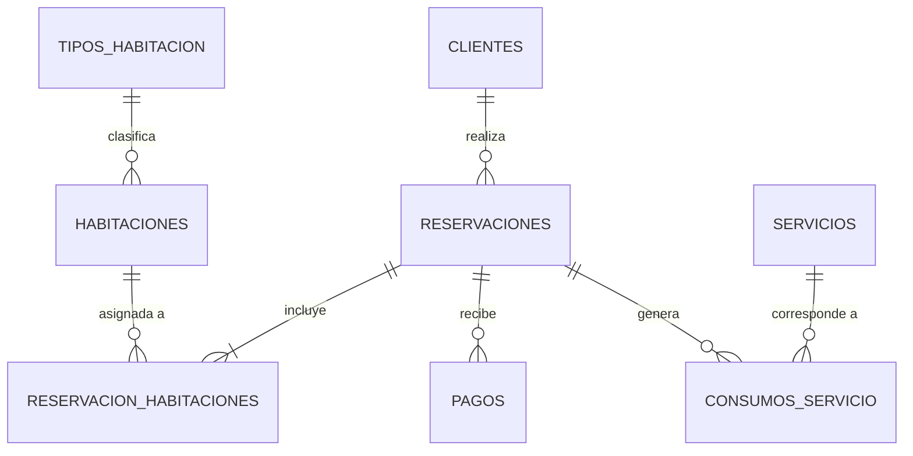

# Sistema de Gestión Hotelera y Reservaciones (PostgreSQL)

Proyecto integral de diseño, implementación, optimización y despliegue de una base de datos relacional para la gestión operativa de un hotel utilizando **PostgreSQL 17**, administrado con **DBeaver** y preparado para despliegue en la nube mediante **Amazon RDS for PostgreSQL**.

---

## 📌 Contexto del Proyecto

El objetivo principal es demostrar un diseño relacional sólido, garantizando:
* **Integridad referencial y de dominio:** Validaciones estrictas con llaves primarias, foráneas, restricciones `CHECK` y `UNIQUE`.
* **Operaciones CRUD:** Scripts reproducibles para manipulación y consulta de datos.
* **Consultas multi-tabla avanzadas:** Cruces relacionales (`JOIN`), agregaciones, control de saldos y cálculo de ocupación.
* **Control de concurrencia y traslapes:** Detección y bloqueo de colisiones en reservaciones de habitaciones.
* **Rendimiento e indexación:** Análisis de planes de ejecución mediante `EXPLAIN ANALYZE` y evaluación con volúmenes de datos sintéticos (1k a 50k registros).
* **Paridad de entornos:** Ejecución idéntica en entorno local y en servidor remoto administrado (**Amazon RDS**).

---

## 🛠️ Tecnologías y Herramientas

| Componente | Herramienta | Versión / Detalle |
|---|---|---|
| **Motor de Base de Datos** | PostgreSQL | 17.x (Local y Amazon RDS) |
| **Cliente de Administración** | DBeaver Community | Gestión visual y ejecución SQL |
| **Control de Versiones** | Git & GitHub | Commits semánticos y flujo estructurado |
| **Servicio Cloud** | Amazon Web Services (AWS) | Amazon RDS for PostgreSQL |
| **Documentación** | GitHub Markdown & Mermaid | Especificación de esquemas y bitácoras |

> **Nota de alcance:** Este proyecto no requiere frontend ni backend (Node.js, Spring Boot, etc.), centrándose exclusivamente en la ingeniería y desempeño de la base de datos relacional.

---

## 📐 Modelo Entidad-Relación



---

## 📂 Estructura del Repositorio

```text
hotel-database/
├── .gitignore                      # Exclusión de credenciales y temporales
├── README.md                       # Documentación principal del proyecto
├── GUIA_DESARROLLO_SISTEMA_HOTELERO.md # Especificación y lineamientos originales
│
├── docs/
│   ├── desarrollo.md               # Bitácora detallada de decisiones y etapas
│   ├── modelo-datos.md             # Diccionario de datos y justificación técnica
│   └── uso-ia.md                   # Registro de interacción y verificación con IA
│
├── sql/
│   ├── 01_schema.sql               # Definición DDL de las 8 tablas
│   ├── 02_constraints.sql          # Restricciones PK, FK, CHECK y UNIQUE
│   ├── 03_seed.sql                 # Dataset inicial coherente para pruebas
│   ├── 04_crud.sql                 # Operaciones CRUD con comprobaciones pre/post
│   ├── 05_queries.sql              # Consultas de negocio (Q01 a Q10 + reportes)
│   ├── 06_indexes.sql              # Índices justificados con EXPLAIN ANALYZE
│   ├── 07_tests.sql                # Suite de pruebas de integridad (positivas y negativas)
│   ├── 08_volume_tests.sql         # Pruebas de carga con generate_series()
│   └── 09_cleanup.sql              # Script para demoler y recrear el entorno
│
└── evidence/
    ├── local/                      # Evidencias y capturas en entorno local
    │   ├── schema/
    │   ├── constraints/
    │   ├── queries/
    │   ├── performance/
    │   └── concurrency/
    └── aws/                        # Evidencias de conexión y pruebas en Amazon RDS
        ├── connection/
        └── validation/
```

---

## 🚀 Orden Obligatorio de Ejecución

Para levantar la base de datos desde cero, conéctese a la base de datos `hotel_db` y ejecute los scripts en el siguiente orden secuencial:

1. **`sql/01_schema.sql`**: Crea las tablas base en orden dependiente.
2. **`sql/02_constraints.sql`**: Aplica llaves foráneas, reglas de negocio (`CHECK`) e índices únicos.
3. **`sql/03_seed.sql`**: Carga el conjunto de datos inicial para desarrollo.
4. **`sql/06_indexes.sql`**: Añade índices de rendimiento para optimización de consultas.
5. **`sql/04_crud.sql` / `sql/05_queries.sql` / `sql/07_tests.sql`**: Ejecución de operaciones y validaciones de negocio.

Para reiniciar completamente el ambiente:
* Ejecutar **`sql/09_cleanup.sql`** y reiniciar el flujo desde el paso 1.

---

## 🔒 Buenas Prácticas de Seguridad
* **Nunca subir credenciales:** Los endpoints de RDS, usuarios y contraseñas jamás deben versionarse en Git.
* **Seguridad en AWS:** El Security Group de RDS debe configurarse restringiendo el puerto 5432 únicamente a la dirección IP pública del desarrollador (`/32`), evitando reglas abiertas `0.0.0.0/0`.
