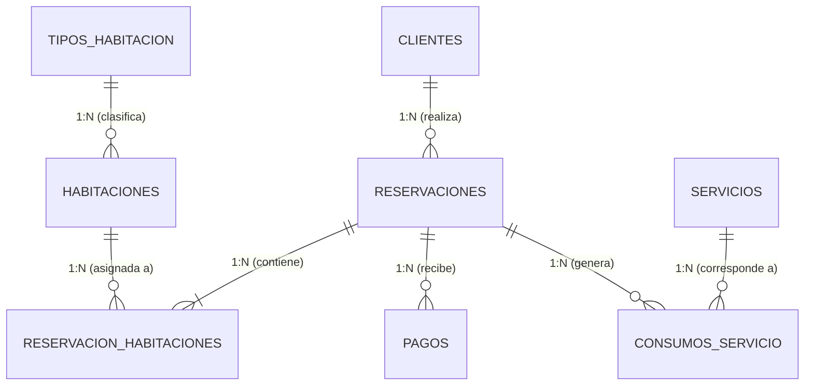

# Modelo de Datos — Sistema de Gestión Hotelera

Documentación técnica del diseño relacional implementado en PostgreSQL para el Sistema de Gestión Hotelera y Reservaciones.

---

## 1. Diagrama Entidad-Relación

---

## 2. Diccionario de Datos

### 2.1 Tabla `clientes`
Almacena la información de los huéspedes titulares de las reservaciones.

| Campo | Tipo de Dato | Nulidad | Llave / Regla | Descripción |
|---|---|---|---|---|
| `id_cliente` | `BIGINT` | NOT NULL | **PK** (`ALWAYS AS IDENTITY`) | Identificador único del cliente |
| `nombre` | `VARCHAR(80)` | NOT NULL | - | Nombre(s) del cliente |
| `apellido` | `VARCHAR(100)` | NOT NULL | - | Apellidos del cliente |
| `correo` | `VARCHAR(150)` | NOT NULL | **UNIQUE**, `chk_cliente_correo_formato` | Correo electrónico único para contacto |
| `telefono` | `VARCHAR(20)` | NULL | - | Número de teléfono opcional |
| `fecha_registro` | `TIMESTAMP` | NOT NULL | DEFAULT `CURRENT_TIMESTAMP` | Fecha y hora de alta en el sistema |

---

### 2.2 Tabla `tipos_habitacion`
Catálogo de categorías de habitaciones (sencilla, doble, suite, etc.).

| Campo | Tipo de Dato | Nulidad | Llave / Regla | Descripción |
|---|---|---|---|---|
| `id_tipo` | `SMALLINT` | NOT NULL | **PK** (`ALWAYS AS IDENTITY`) | Identificador de la categoría |
| `nombre` | `VARCHAR(50)` | NOT NULL | **UNIQUE** | Nombre distintivo del tipo de habitación |
| `descripcion` | `TEXT` | NULL | - | Descripción de comodidades incluidas |
| `capacidad` | `SMALLINT` | NOT NULL | `CHECK (capacidad > 0)` | Número máximo de huéspedes permitidos |
| `precio_noche` | `NUMERIC(10,2)`| NOT NULL | `CHECK (precio_noche > 0)` | Tarifa base por noche de alojamiento |

---

### 2.3 Tabla `habitaciones`
Representa cada habitación física del hotel.

| Campo | Tipo de Dato | Nulidad | Llave / Regla | Descripción |
|---|---|---|---|---|
| `id_habitacion` | `BIGINT` | NOT NULL | **PK** (`ALWAYS AS IDENTITY`) | Identificador físico de la habitación |
| `numero` | `VARCHAR(10)` | NOT NULL | **UNIQUE** | Número o código visible de la puerta |
| `id_tipo` | `SMALLINT` | NOT NULL | **FK** -> `tipos_habitacion(id_tipo)` | Categoría a la que pertenece |
| `piso` | `SMALLINT` | NOT NULL | `CHECK (piso >= 1)` | Nivel o planta donde se ubica |
| `activa` | `BOOLEAN` | NOT NULL | DEFAULT `TRUE` | `TRUE`: disponible; `FALSE`: mantenimiento |

---

### 2.4 Tabla `reservaciones`
Registra el contrato o solicitud general de hospedaje de un cliente.

| Campo | Tipo de Dato | Nulidad | Llave / Regla | Descripción |
|---|---|---|---|---|
| `id_reservacion` | `BIGINT` | NOT NULL | **PK** (`ALWAYS AS IDENTITY`) | Folio identificador de la reservación |
| `id_cliente` | `BIGINT` | NOT NULL | **FK** -> `clientes(id_cliente)` | Huésped titular responsable |
| `fecha_reserva` | `TIMESTAMP` | NOT NULL | DEFAULT `CURRENT_TIMESTAMP` | Momento en que se emite la reserva |
| `fecha_entrada` | `DATE` | NOT NULL | - | Fecha de inicio del hospedaje (check-in) |
| `fecha_salida` | `DATE` | NOT NULL | `CHECK (fecha_salida > fecha_entrada)` | Fecha de término (check-out) |
| `estado` | `VARCHAR(20)` | NOT NULL | `CHECK (estado IN ('PENDIENTE', 'CONFIRMADA', 'EN_CURSO', 'FINALIZADA', 'CANCELADA'))` | Estado del ciclo de vida de la reserva |
| `total_estimado`| `NUMERIC(12,2)`| NOT NULL | `CHECK (total_estimado >= 0)` | Monto proyectado (habitaciones + cuotas base) |

---

### 2.5 Tabla `reservacion_habitaciones`
Tabla de asociación que soporta que una misma reservación incluya una o múltiples habitaciones físicas.

| Campo | Tipo de Dato | Nulidad | Llave / Regla | Descripción |
|---|---|---|---|---|
| `id_reservacion_habitacion` | `BIGINT` | NOT NULL | **PK** (`ALWAYS AS IDENTITY`) | Identificador del detalle |
| `id_reservacion` | `BIGINT` | NOT NULL | **FK** -> `reservaciones` (`ON DELETE CASCADE`) | Folio de reservación asociado |
| `id_habitacion` | `BIGINT` | NOT NULL | **FK** -> `habitaciones` (`ON DELETE RESTRICT`) | Habitación física asignada |
| `precio_noche` | `NUMERIC(10,2)`| NOT NULL | `CHECK (precio_noche > 0)` | Precio acordado por noche (congelado) |

---

### 2.6 Tabla `pagos`
Registra abonos o liquidaciones financieras aplicadas a una reservación.

| Campo | Tipo de Dato | Nulidad | Llave / Regla | Descripción |
|---|---|---|---|---|
| `id_pago` | `BIGINT` | NOT NULL | **PK** (`ALWAYS AS IDENTITY`) | Folio único de recibo de pago |
| `id_reservacion` | `BIGINT` | NOT NULL | **FK** -> `reservaciones` (`ON DELETE RESTRICT`) | Reservación receptora del abono |
| `fecha_pago` | `TIMESTAMP` | NOT NULL | DEFAULT `CURRENT_TIMESTAMP` | Fecha y hora exacta de la transacción |
| `monto` | `NUMERIC(12,2)`| NOT NULL | `CHECK (monto > 0)` | Importe monetario abonado |
| `metodo` | `VARCHAR(30)` | NOT NULL | `CHECK (metodo IN ('EFECTIVO', 'TARJETA', 'TRANSFERENCIA'))` | Medio utilizado |
| `referencia` | `VARCHAR(100)`| NULL | - | Código o número de transacción bancaria |

---

### 2.7 Tabla `servicios`
Catálogo de amenidades y servicios adicionales disponibles en el hotel.

| Campo | Tipo de Dato | Nulidad | Llave / Regla | Descripción |
|---|---|---|---|---|
| `id_servicio` | `BIGINT` | NOT NULL | **PK** (`ALWAYS AS IDENTITY`) | Identificador del servicio |
| `nombre` | `VARCHAR(80)` | NOT NULL | **UNIQUE** | Nombre del servicio (ej. Desayuno buffet) |
| `precio` | `NUMERIC(10,2)`| NOT NULL | `CHECK (precio >= 0)` | Tarifa unitaria estándar |
| `activo` | `BOOLEAN` | NOT NULL | DEFAULT `TRUE` | `TRUE`: disponible; `FALSE`: suspendido |

---

### 2.8 Tabla `consumos_servicio`
Registra los consumos específicos realizados durante la estancia de una reservación.

| Campo | Tipo de Dato | Nulidad | Llave / Regla | Descripción |
|---|---|---|---|---|
| `id_consumo` | `BIGINT` | NOT NULL | **PK** (`ALWAYS AS IDENTITY`) | Folio de cargo de servicio |
| `id_reservacion` | `BIGINT` | NOT NULL | **FK** -> `reservaciones` (`ON DELETE RESTRICT`) | Reservación a la que se carga |
| `id_servicio` | `BIGINT` | NOT NULL | **FK** -> `servicios` (`ON DELETE RESTRICT`) | Servicio solicitado |
| `cantidad` | `INTEGER` | NOT NULL | `CHECK (cantidad > 0)` | Unidades consumidas |
| `precio_unitario`| `NUMERIC(10,2)`| NOT NULL | `CHECK (precio_unitario >= 0)` | Tarifa unitaria aplicada al momento |
| `fecha_consumo`| `TIMESTAMP` | NOT NULL | DEFAULT `CURRENT_TIMESTAMP` | Momento exacto del consumo |

---

## 3. Justificación de Decisiones Técnicas

1. **Tipos de Identificadores:** Se utiliza `GENERATED ALWAYS AS IDENTITY` sobre `SERIAL` por ser el estándar moderno SQL:2003+ promovido por PostgreSQL, evitando la manipulación manual de secuencias subyacentes.
2. **Tipos Monetarios:** Se emplea `NUMERIC(12,2)` y `NUMERIC(10,2)`. El uso de `FLOAT` o `REAL` generaría errores de redondeo inaceptables en contabilidad y balances.
3. **Manejo de Borrados (`ON DELETE`):**
   * Las tablas contables (`pagos`, `consumos_servicio`) y estructurales (`reservaciones`, `habitaciones`) usan `ON DELETE RESTRICT` o `NO ACTION` por defecto. Si se intenta eliminar un cliente con historial o una habitación con historial de reservas, el motor rechaza la operación protegiendo la integridad histórica.
   * La tabla puente `reservacion_habitaciones` utiliza `ON DELETE CASCADE` exclusivamente hacia `reservaciones`, de modo que si se descarta una cotización o borrador de reservación, su detalle se depura de forma atómica.
